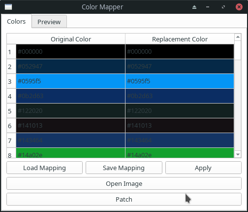
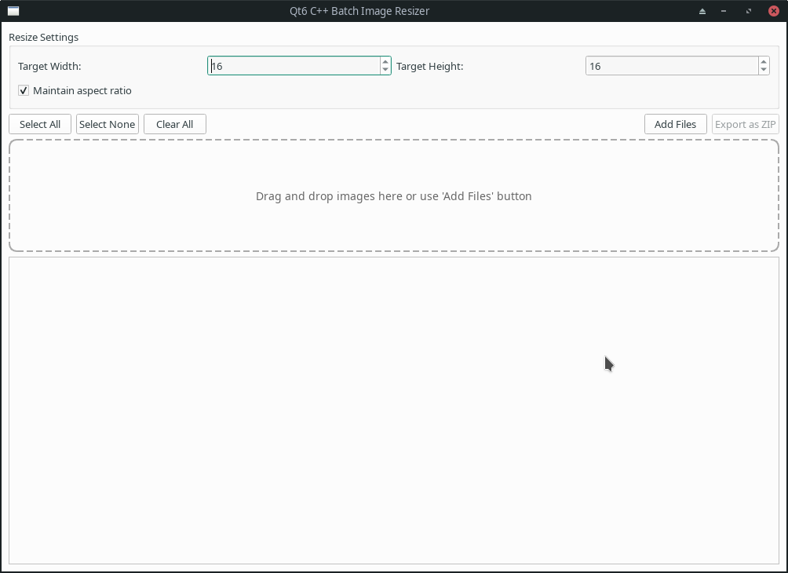
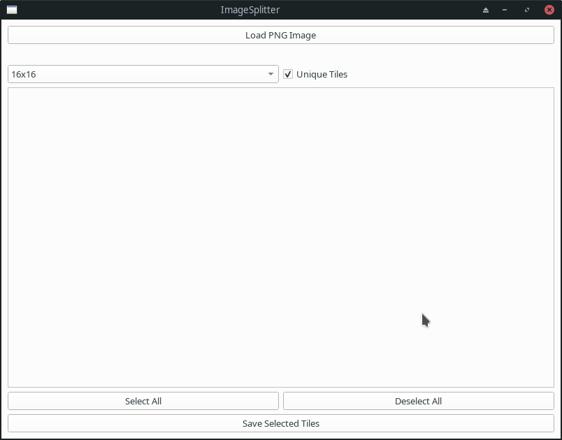
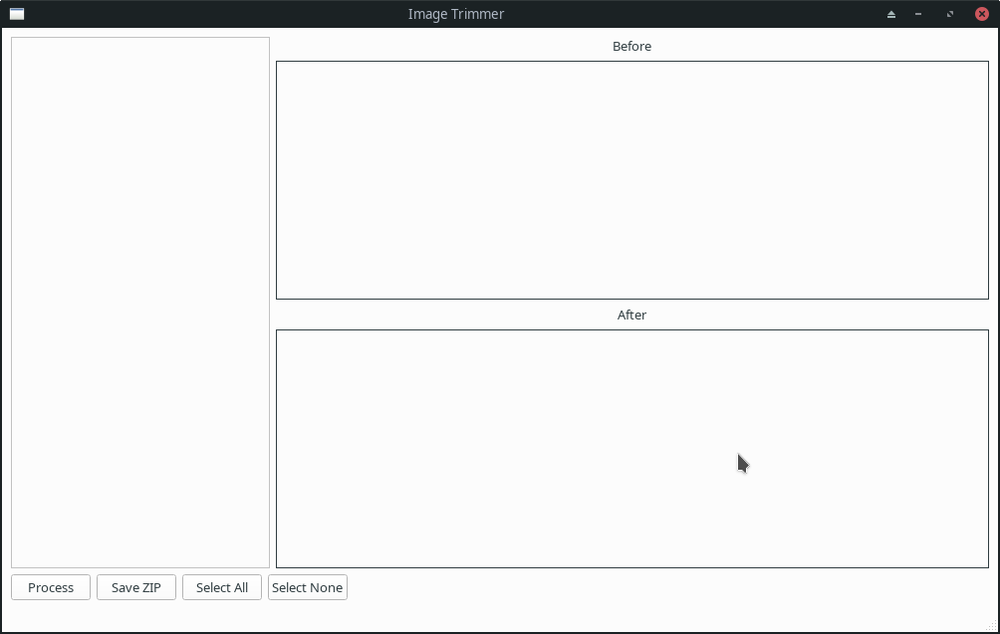
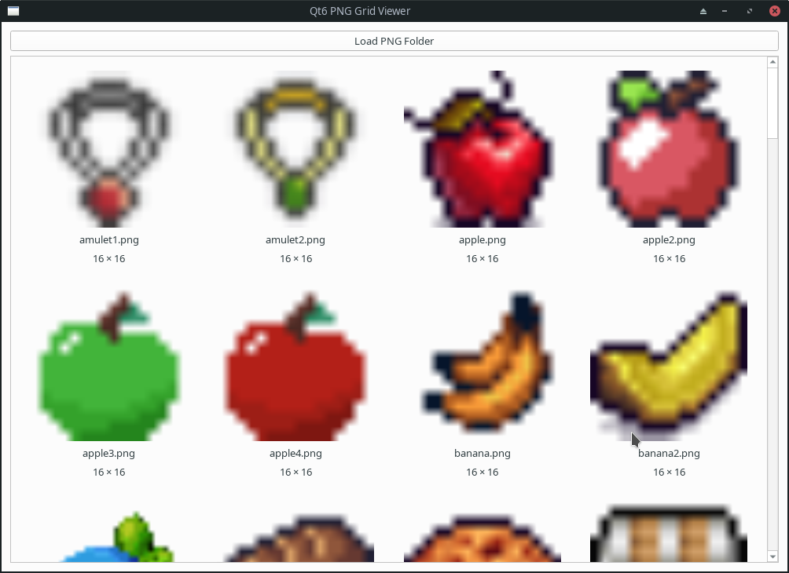

# ImageTools

This reposittory is a collection of image editing tools that use for improving the Creepspread III remake.

Since these are reusable, I decided to archive them here on github for future reference.

## Color Mapper

Create special colormap to recolor sprites on the fly.

)

## Hitbox Editor

Define a special hitbox for sprite sheets. Allowing multiple collion areas per frame.

## Image Resizer

Batch resize images to a new dimension. Ideal for working with 32px and converting them to 16px.

## Image Slicer

Break sprite sheet into indidual PNG images.

## Image Trimmer

Batch remove empty/unused portion of images.

## Image Viewer

Browse folder to view a large number of images at once.

## Viewer

Custom image viewer designed to work with custom formats that I developed over the year (mcx, obl, imc1 etc).

